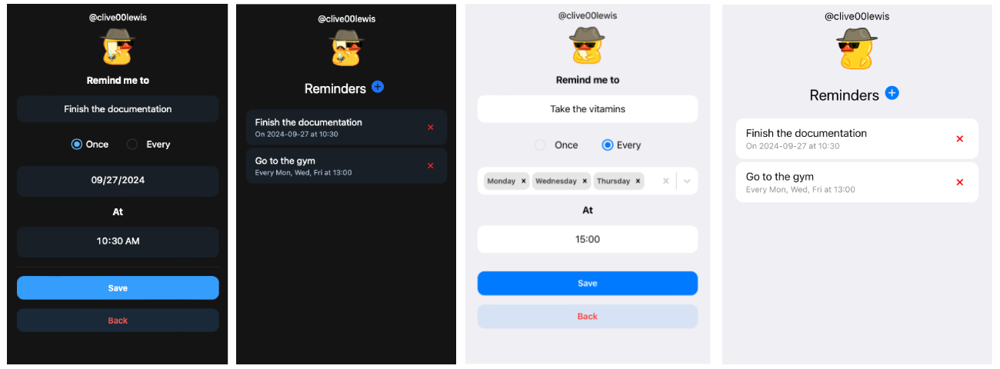

#  Reminder Telegram Mini App

Reminder Telegram Mini App, developed for my private Telegram Bot. Feel free to use it as a learning source if you're interested in developing [Telegram Mini Apps](https://core.telegram.org/bots/webapps) 🙂 



## Description

The Reminder Telegram Mini App allows users to set and manage reminders through simple UI. It can be integrated with the backend to send reminders directly to the Telegram user. The API design that i'm using can be checked in the [ReminderApiClient](/src/services/client/ReminderApiClient.ts) class. 

❗The project utilizes the [WebApp](https://core.telegram.org/bots/webapps#cloudstorage) object extensively for functionalities such as fetching user information, managing global configurations, dynamic theming, displaying popup screens, and handling back buttons. Therefore, the project won't work properly unless it's opened through Telegram.


❗The backend code that is responsible to CRUD operations and actual reminder sending logic is not part of this project, you'll have to implement it yourself. 😃 [CloudStorageClient](/src/services/client/CloudStorageClient.ts) utilizes [Telegram Mini App Cloud Storage](https://core.telegram.org/bots/webapps#cloudstorage) and can be used as a local pseudo-backend for CRUD operations.

## Features

- Create Two Types of Reminders:
  - One-Time Reminder: Set a reminder for a specific date and time.
  - Repeating Reminder: Schedule reminders for specific days of the week.
- Manage Reminders: View and delete your existing reminders easily.
- CloudStorage: Store created reminders in a Telegram's cloud storage.
- Dynamic Theme Colors: The app adapts to your Telegram theme colors for a seamless experience.
- Native Date and Time Selectors: Utilizes platform-specific date and time pickers.


## Stack

-  **Vite:** A fast build tool and development server.
-  **React:** A JavaScript library for building user interfaces.
-  **Typescript:** A strongly typed programming language that builds on JavaScript.

## Dependencies

*I aimed to minimize the use of dependencies to keep the project lightweight.*

- [TWA SDK](https://github.com/twa-dev/SDK) - Telegram Web App (MiniApp) SDK
- [Telegram UI Kit](https://github.com/Telegram-Mini-Apps/TelegramUI) - Great pre-designed components
- [React Select](https://github.com/jedwatson/react-select) - Flexible and easy to use Select input

## Installation

1. Clone the repository:
    
```bash
git clone git@github.com:clivelewis/reminder-miniapp.git
```
2. Navigate to the project directory:
    
```bash
cd reminder-miniapp
```
3. Install dependencies:
    
```bash
npm install
```    
4. Start the development server:
    
```bash
npm run dev
```  

## How to properly run through Telegram
This is a tricky part because Telegram only accepts HTTPS links with a valid SSL certificate. This means you can't simply use http://localhost:5173. Some of the ways of how to solve this problem:

- Host the website on GitHub Pages or any other hosting.
- Run a tunnel like [tunnelto.dev](https://tunnelto.dev/) or [ngrok](https://ngrok.com/).
- Use the [test environment](https://docs.ton.org/develop/dapps/telegram-apps/testing-apps) provided by Telegram.

Personally, I use [tunnelto.dev](https://tunnelto.dev/). It's a great tool, but costs 2$/month.


- [Official Telegram Mini Apps page with a lot of useful info](https://core.telegram.org/bots/webapps)
- [How to create a new app in Telegram](https://docs.telegram-mini-apps.com/platform/creating-new-app)


## Contact

Feel free to reach out to me on [@clive00lewis](https://t.me/clive00lewis)
